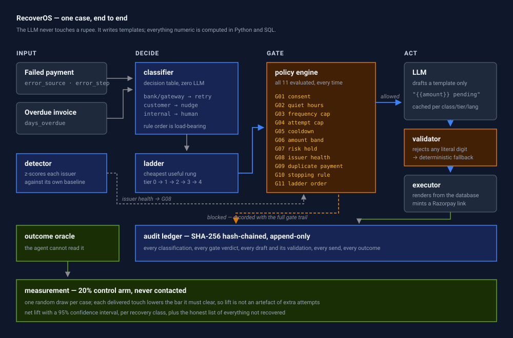

# Architecture

## The claim, and how it is enforced

> The LLM never touches a rupee.

Stated as a property rather than an intention, it means: no numeric value that
reaches a customer or a ledger row was produced by a language model. Three
mechanisms hold it up.

1. **The model is only asked for templates.** `app/llm/prompts.py` gives it a
   *situation* — a recovery class, a channel, a language. It never receives a
   customer, an amount, an invoice id, or a link.
2. **A validator rejects digits.** `app/llm/validator.py` strips placeholders
   from the draft body and refuses it if a single digit remains. `{{amount}}` is
   fine; `₹1,499` is not.
3. **Rendering is string substitution.** `app/llm/client.render()` fills the
   template from values the database computed. An unknown placeholder is left
   visible rather than silently blanked, because a message reading `{{days}}` is
   an obvious bug and a message reading "pending for  days" ships.

If the model is unavailable, rate-limited, or returns something the validator
refuses, a deterministic Jinja-style template is used, the reason is recorded on
the action row, and the batch continues.

---

## The pipeline



```
                          ┌───────────────────────────────┐
  payment history ───────▶│ detector                      │
                          │ z-score each issuer against   │
                          │ its own baseline              │
                          └───────────────┬───────────────┘
                                          │ issuer health windows
                                          ▼
  ┌──────────┐    ┌──────────────┐   ┌─────────┐   ┌────────────────┐
  │  case    │───▶│  classifier  │──▶│ ladder  │──▶│ policy engine  │
  └──────────┘    │ decision     │   │ next    │   │ 11 gates       │
                  │ table, 0 LLM │   │ cheapest│   │ all evaluated  │
                  └──────────────┘   │ rung    │   └────────┬───────┘
                                     └─────────┘            │
                                                    allowed │ blocked
                                                            ▼       ▼
                                                  ┌─────────────────────┐
                                                  │ executor            │
                                                  │ template → render → │
                                                  │ link → send         │
                                                  └──────────┬──────────┘
                                                             ▼
                                                  ┌─────────────────────┐
                                                  │ ledger              │
                                                  │ SHA-256 chained     │
                                                  └─────────────────────┘
```

Every arrow writes a ledger event. A case's entire life is reconstructable from
`events` alone.

---

## The clock

`app/core/clock.py` is the least glamorous module and the one the rest depends
on. Four gates read "now": quiet hours, cooldown, frequency cap, issuer health.
If "now" is `datetime.now()`, the same repo produces different numbers depending
on the hour it is run — at 23:00 IST the quiet-hours gate blocks every outreach
in the batch.

So the dataset is generated relative to a fixed epoch, and the batch is a
discrete-event simulation:

```
DATA_EPOCH                        BATCH_START                    BATCH_END
    |◀──── 72h of failed ────────▶|◀──── 84 ticks × 2h ─────────▶|
    |      payments               |      = 7 days                |
                                  ▲
                        the issuer outage straddles
                        this boundary on purpose, so the
                        detector is still degraded when the
                        first ticks run and recovers partway
```

Consequences worth naming:

- The escalation ladder actually escalates, because time passes between touches.
- A cooldown is a real constraint, not a field nobody reads.
- Some ticks are at night, so quiet hours matter.
- The held retries against a degraded issuer are *released* when it recovers,
  which is the behaviour worth demonstrating.

---

## Classification — a decision table, not a model

Razorpay already tells you why a payment failed, in two fields that between them
answer the only question that matters:

| Field | Question it answers |
| --- | --- |
| `error_source` | Whose fault was it — bank, gateway, customer, internal? |
| `error_step` | Where did it break — initiation, authentication, authorization, capture, response? |

Bank or gateway means the customer did nothing wrong: retry silently. Customer
source means only the customer can fix it: a retry is pointless and a nudge is
the cheapest thing that can work. Internal risk means do not touch it.

Routing on Razorpay's taxonomy rather than a taxonomy we invented means every
decision traces back to a field the merchant can see in their own dashboard.

Rule order is load-bearing: `DEAD` and `MANUAL_REVIEW` sit above every outreach
branch, so a risk-blocked or already-settled case cannot fall through into a
messaging campaign whatever else is true about it. Full table in
[docs/decision-table.md](docs/decision-table.md).

Two of the ten rules are product decisions rather than lookups:

- **`MANDATE_REPAIR`** — a revoked mandate cannot be *retried*, so every attempt
  against it is guaranteed to fail and would spend one of the case's three
  attempts proving it. But re-authorisation is a different action, not the
  absence of one. Classifying this as `DEAD` was the conservative reading and
  it wrote off recoverable subscription revenue.
- **`CHECKOUT_ABANDONED`** — the only class with no error taxonomy to route on,
  because nothing was ever attempted. No failure to diagnose and nothing to
  retry, so it gets a shorter two-touch ladder. Somebody who ignored two
  reminders about a cart they abandoned is not a debtor.

---

## The policy engine

Eleven gates, evaluated in order, on every proposed action. Two design choices:

**All eleven are evaluated, even after one has refused.** The first blocker
stops the action, but the full trail is what a compliance reviewer needs. "It
was blocked by consent" is much weaker than "it was blocked by consent, and
here is what the other ten thought." The dashboard renders the trail as an
eleven-cell grid on every action.

**A block records what it was worth.** Avoided spend, and — for consent, DND,
quiet-hours, frequency and risk blocks — a priced compliance exposure.
Guardrails that only ever appear as absences cannot be valued, and anything that
cannot be valued gets cut in the next planning cycle.

Full table with rules in [docs/guardrails.md](docs/guardrails.md).

### Scheduling is not enforcement

The orchestrator parks a case that a gate has just refused for a known number of
ticks — a 24-hour frequency cap cannot clear in under twelve two-hour ticks — so
60,000 pointless gate evaluations become a dictionary lookup. This is an
optimisation only. The wait always mirrors the gate's own rule, so parking never
lets through an action the gates would have refused.

One deliberate exception: the cooldown parks for two ticks rather than three, so
G05 genuinely refuses the case once and that refusal is recorded. Otherwise the
scheduler would enforce the rule silently and G05 would look like dead code in
the audit trail.

---

## The escalation ladder

| Tier | Channel | Cost | Earned by |
| --- | --- | --- | --- |
| 0 | Silent gateway retry | ₹0.00 | infrastructure or balance failure, issuer healthy |
| 1 | WhatsApp / email + link | ₹0.30 | tier 0 failed or does not apply |
| 2 | SMS + link | ₹0.20 | no response at tier 1 |
| 3 | Hinglish voice call | ₹1.50 | tiers 1–2 spent, amount ≥ ₹2,000, voice consent on file |
| 4 | Human queue | ₹50.00 | risk-blocked, or everything else exhausted |

`MANDATE_REPAIR` never touches tier 0: a silent retry against a dead
authorisation is guaranteed to fail. `CHECKOUT_ABANDONED` stops after tier 2
rather than running the full ladder.

The ladder proposes; the policy engine disposes. `get_next_action` returns an
*intent* and nothing is sent until all eleven gates pass.

Note what the ladder does *not* do: enforce the attempt budget. That is G04's
job. Duplicating the rule in both places would mean it is enforced twice and
audited in neither.

Within tier 1, the channel is chosen from what the customer has actually
consented to. The ladder decides how hard to push; consent decides which door to
knock on.

---

## Prioritisation

Cases are worked in descending order of amount at risk. A customer's contact
budget is finite — one touch a day, three a week, across all their cases — so
within a tick it is a scarce resource. Spending it on a ₹800 abandoned cart
before a ₹90,000 overdue invoice is the wrong allocation, and ordering by
`case_id` would make that allocation an accident of the primary key.

---

## The audit ledger

Append-only. Each row's hash covers the previous row's hash plus its own
canonical JSON, so editing any historical row invalidates it.

`verify_chain` walks forward from each row's *stored* predecessor hash rather
than the recomputed one, so an edited row is named on its own instead of
dragging every later row into the report. Naming one row says exactly which
decision was rewritten; naming four hundred says nothing.

`ts` is stored as the same ISO-8601 string that was hashed. The earlier version
hashed a timezone-aware timestamp and stored a SQLite `DateTime`, which comes
back naive — so verification re-serialised a different string and every row
failed. See [2AM.md](2AM.md).

The chain head is cached in-process during a batch. Re-reading the tail row
before each of several thousand appends made the ledger the slowest part of the
system.

---

## Measurement

`app/analytics/experiment.py`. The design decisions that matter:

- **Arm assignment is `sha256(id + salt) % 100 < 20`.** A pure function of the
  id: fixed before anything is known about the case, and independently
  recomputable by anyone checking that cases were not moved between arms after
  the outcomes were known.
- **Control cases are classified, measured, and never contacted.** An
  end-to-end test fails if a single action lands on one.
- **One random draw per case**, with each delivered touch lowering the bar it
  has to clear. Independent draws per touch would give a three-touch case three
  chances against control's one, and the lift would be an artefact of the
  simulation rather than a measurement of the policy.
- **Two lift figures**, because they disagree: case-count lift weights a small
  cart the same as a large invoice, value-weighted lift does not. Both are
  shown rather than whichever is larger.
- **Per-class breakdown**, because aggregate lift can hide a lane that outreach
  is actively hurting.

---

## The outcome oracle

`app/sim/oracle.py` decides whether a case recovered. It plays by four rules:

1. No decision module reads it. The classifier, the ladder, the policy engine,
   the detector and the live webhook handler do not import it, so nothing in
   the oracle can change what the agent chooses to do. The orchestrator *does*
   import it — something has to record outcomes — and calls only the four
   functions that report one, after it has already decided and acted, the way
   it would ask a payment gateway. A test pins both halves.

   This boundary is what makes [sensitivity analysis](docs/sensitivity.md)
   possible: because no decision can depend on these numbers, changing them
   re-decides outcomes over a fixed run instead of producing a different run.
2. Seeded per case, so the same case with the same treatment always resolves
   the same way. Re-running cannot fish for a better number.
3. Local RNG. A global `random.seed()` would make every other seeded component
   depend on the order the oracle happened to be called in.
4. Base rates written down and justified in
   [docs/assumptions.md](docs/assumptions.md), including the control-arm rates.

---

## The live path

A simulation invites one fair objection: the logic might only work because a
batch hands it a tidy world, one case at a time, with every fact pre-joined.

`app/core/live.py` answers it by taking a real Razorpay `payment.failed`
webhook and running it through `classify`, `get_next_action` and `evaluate` —
literally the same three functions the tick loop calls. It imports them; it
does not reimplement them. If it did, the demonstration would prove nothing,
because two implementations agreeing is not the same as one implementation
being reused.

Two things differ from a tick, and both are deliberate:

**The clock.** A webhook arrives at a real instant, so `datetime.now(utc)` is
correct here and nowhere else. The batch reads the fixed clock precisely so it
stays reproducible; borrowing that clock for a live event would date every
decision to a fixed day in the past.

**The book.** Live decisions are appended to `live_decisions`, a separate
hash-chained table with its own verification, not to `events`. The committed
evaluation is derived from `events` — so one live decision written there would
move the published numbers the first time anyone tried the webhook, and the
run would stop being reproducible. Same chaining rules, different book.

The endpoint decides and stops. Sending would mean a real message and a real
charge; the scheduler that would own a case across seven days of real time is
listed as cut in [docs/future-scope.md](docs/future-scope.md).

---

## Data model

`customers · orders · payments · invoices · cases · actions · events`

Two things worth pointing at:

**`actions` holds refused attempts too**, with `status = BLOCKED`, the blocking
gate, and the full eleven-gate trail as JSON. Blocked attempts are the evidence
that the guardrails did something, so they are first-class rows rather than log
lines.

**`cases.customer_id` is denormalised.** The frequency cap is evaluated on every
one of roughly 57,000 gate checks, and it should not need a join each time.

---

## Deployment

Backend on Render, frontend on Vercel, both free tier.

`allow_origins` includes the Vercel origin from day one rather than deploy day —
a CORS failure is indistinguishable from a dead backend in the browser, and
debugging that against a cold free-tier instance is a bad way to spend an hour.

Render's filesystem is ephemeral, so `demo.db` can vanish on restart. The app
recreates the schema at startup and comes back with empty tables and a working
`/api/health` rather than 500s on every route.
